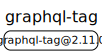

# 源码分析

## 文件结构

``` bash
/Users/liufang/openSource/FunnyLiu/graphql-tag
├── CHANGELOG.md
├── CONTRIBUTING.md
├── LICENSE
├── README.md
├── index.d.ts
├── loader.js
├── package-lock.json
├── package.json
├── rollup.config.js
├── src
|  ├── index.js
|  └── index.js.flow
└── yarn.lock

directory: 1 file: 14

ignored: directory (1)

```

## 外部模块依赖



## 内部模块依赖


  